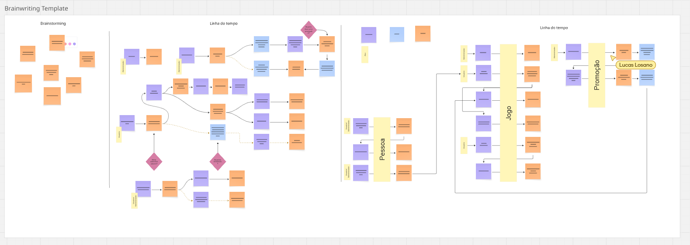

# FIAP Cloud Games 🚀

API RESTful para gerenciar usuários e biblioteca de jogos digitais, desenvolvida em **.NET 8** como MVP para a plataforma FIAP Cloud Games. Este repositório reúne todo o código-fonte, documentação e instruções de uso.

---

## Índice 📑

1. [🎯 Objetivos](#objetivos)
2. [🖼️ Visão Geral do Projeto](#visão-geral-do-projeto)
3. [📈 Diagrama de Estrutura](#diagrama-de-estrutura)
4. [🛠️ Tecnologias](#tecnologias)
5. [📋 Pré-requisitos](#pré-requisitos)
6. [📂 Estrutura do Repositório](#estrutura-do-repositório)
7. [⚙️ Configuração Inicial](#configuração-inicial)

   - [1. Clonar o Repositório](#1-clonar-o-repositório)
   - [2. Ajustar Strings de Conexão](#2-ajustar-strings-de-conexão)

8. [▶️ Como Executar a API](#como-executar-a-api)

   - [🔍 Acesse o Swagger](#acesse-o-swagger)

9. [🔗 Endpoints Principais](#endpoints-principais)

   - [🔑 Autenticação](#autenticação)
   - [👤 Usuários](#usuários)
   - [🎮 Jogos](#jogos)
   - [📚 Biblioteca de Jogos](#biblioteca-de-jogos)

10. [✅ Testes Unitários](#testes-unitários)
11. [🤝 Contribuindo](#contribuindo)
12. [📄 Licença](#licença)

---

## 🎯 Objetivos

- **Cadastro de Usuários**

  - Persistir informações de clientes (nome, e-mail e senha) em PostgreSQL.
  - Validar formato de e-mail e exigir senha segura (mín. 8 caracteres, incluindo letras, números e caracteres especiais).

- **Autenticação e Autorização**

  - Autenticação via JWT.
  - Dois perfis de acesso:

    - **Usuário**: consulta catálogo e biblioteca de jogos.
    - **Administrador**: cadastra jogos, gerencia usuários e cria promoções.

- **Gerenciamento de Jogos**

  - CRUD completo de jogos (somente administradores), armazenando dados no PostgreSQL.

- **Qualidade de Software**

  - Segregação em camadas (Domain, Infrastructure, Application, API e Tests).
  - Testes unitários cobrindo regras principais de negócio.
  - Configuração de conexões PostgreSQL e Supabase no `appsettings.json`.
  - Documentação de endpoints via Swagger.

---

## 🖼️ Visão Geral do Projeto

O FIAP Cloud Games é um MVP que permite:

1. Cadastrar novos usuários (com perfis “Usuário” ou “Administrador”), gravando dados no PostgreSQL.
2. Autenticar-se via token JWT.
3. Listar, criar, editar e remover jogos (restrito a administradores), com armazenamento no PostgreSQL.
4. Consultar catálogo de jogos por qualquer usuário.

Toda a lógica de persistência está isolada em projetos de **Application** e **Infrastructure**, seguindo boas práticas de Clean Architecture e SOLID, utilizando Entity Framework Core com provedor PostgreSQL.

---

## 📈 Diagrama de Estrutura



> Acesse o template completo no Miro: [Estrutura do Projeto no Miro](https://miro.com/app/board/uXjVIw6cuUU=/)

---

## 🛠️ Tecnologias

<p align="center">
  <a href="https://docs.microsoft.com/dotnet/core/"></a>
  <a href="https://docs.microsoft.com/dotnet/csharp/"></a>
  <a href="https://www.postgresql.org/"></a>
  <a href="https://supabase.com/"></a>
  <a href="https://swagger.io/"></a>
  <a href="https://jwt.io/"></a>
  <a href="https://xunit.net/"></a>
  <a href="https://github.com/"></a>
</p>

- **Linguagem**: C# 10.0 (.NET 8)
- **Framework Web**: ASP.NET Core (Minimal API)
- **Banco de Dados**: PostgreSQL (via Entity Framework Core)
- **Auth**: JWT
- **Testes**: xUnit
- **Documentação**: Swagger UI
- **Versionamento**: GitHub (Git flow)

---

## 📋 Pré-requisitos

Antes de começar, você precisa ter instalado:

1. **.NET 8 SDK** (8.0.x)
2. **PostgreSQL** (local ou hospedado)
3. **IDE ou Editor**: Visual Studio 2022 / Visual Studio Code / Rider
4. **Git** instalado e configurado para clonar repositórios

---

## 📂 Estrutura do Repositório

```
FIAP-Cloud-Games/
├── Application/              ← Casos de uso, DTOs e serviços de aplicação
├── Domain/                   ← Entidades, Value Objects e regras de negócio
├── Infrastructure/           ← Contexto EF Core (PostgreSQL), repositórios concretos
├── FIAP-Cloud-Games/         ← Projeto ASP.NET Core (Program.cs, EndPoints, Middlewares)
├── FIAP-Cloud-GamesTest/     ← Testes de unidade (xUnit, specflow)
├── .gitignore
└── README.md                 ← Este arquivo
```

- **Application**: contém `DTOs/`, `Services/`.
- **Domain**: define entidades principais (`Pessoa`, `Jogo`), Interfaces, Value Objects e Exceptions customizadas.
- **Infrastructure**: implementa `ApplicationDbContext` (PostgreSQL), migrações, repositórios.
- **FIAP-Cloud-Games**: projeto principal que expõe endpoints HTTP, middleware de autenticação e configurações de DI para PostgreSQL.
- **FIAP-Cloud-GamesTest**: contém casos de teste para validar lógica de negócio isolada de banco.

---

## ⚙️ Configuração Inicial

### 1. Clonar o Repositório

```bash
git clone https://github.com/LucasLosano/FIAP-Cloud-Games.git
cd FIAP-Cloud-Games
```

---

### 2. Ajustar ConnectionString

Abra o arquivo FIAP-Cloud-Games/appsettings.json

```bash
{
  "ConnectionStrings": {
    "DefaultConnection": "Server=SEU_SERVIDOR;Database=FIAPCloudGames;User Id=SEU_USUARIO;Password=SUA_SENHA;"
  },
  "Jwt": {
    "Key": "ChaveSuperSecretaParaJWT",
    "Issuer": "FIAPCloudGamesAPI",
    "Audience": "FIAPCloudGamesClient",
    "ExpiresInMinutes": 60
  }
}
```

---

### 3. Aplicar Migrations

No terminal, dentro da pasta raiz do repositório, navegue até Infrastructure/ e execute:

```bash
cd Infrastructure
dotnet ef database update
```

---
